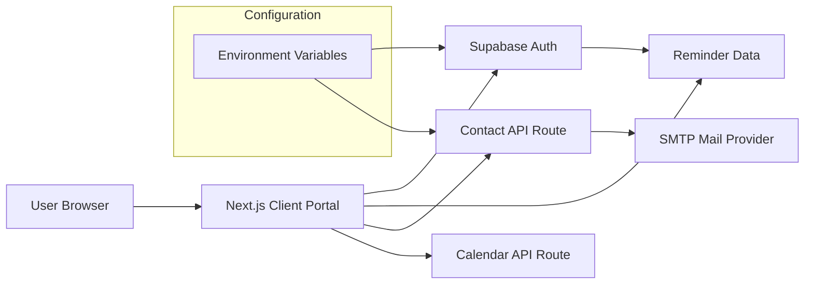

# Client Service Portal Demo

A sanitized portfolio version of a customer self-service portal I built while
learning modern web application development. The original private project was
designed around a real service organization. This public version removes
organization-specific branding, operational links, account identifiers,
credentials, environment values, and other private deployment details.

The goal of this repository is to demonstrate the technical work without
publishing information that could identify, map, or expose the original
environment.

## What this project demonstrates

- Next.js App Router application structure
- React client-side forms and state handling
- Supabase authentication flows
- Authenticated reminder data stored through Supabase
- Server-side email submission with Nodemailer
- Calendar `.ics` generation through an API route
- Reusable form components
- Loading, error, validation, and success states
- Environment-variable based configuration
- Security-focused public repository sanitization
- Technical documentation and architecture review

## Portfolio context

The private source application included organization-specific branding,
customer portal links, payment links, monitoring links, and deployment
configuration. Those details are intentionally not reproduced here.

This repository uses generic names and placeholders so the implementation can
be reviewed without exposing the source environment.

## Architecture



For a deeper explanation, see [`docs/architecture.md`](docs/architecture.md).

## Main features

### Authentication

Users can register, sign in, request a password reset, update a recovered
password, and sign out through Supabase Auth.

### Service request / inquiry / feedback forms

The portal contains reusable form flows for service requests, general inquiries,
and customer feedback. Submissions are sent to a server-side API route rather
than exposing SMTP credentials to the browser.

### Inspection reminders

Authenticated users can save inspection reminders through Supabase, review
upcoming and past reminders, delete saved reminders, and generate a portable
`.ics` calendar file.

### Calendar generation

The `/api/calendar` route accepts reminder details, escapes calendar text, and
returns an `.ics` download suitable for common calendar applications.

## Technology

| Area | Implementation |
| --- | --- |
| Framework | Next.js 16 |
| UI | React 19 |
| Styling | Tailwind CSS |
| Authentication | Supabase Auth |
| Data access | Supabase client |
| Email | Nodemailer over SMTP |
| Calendar export | Server-generated iCalendar |
| Configuration | Environment variables |

## Security approach

The public release intentionally contains:

- no passwords
- no API tokens
- no SMTP credentials
- no Supabase project identifiers
- no live environment files
- no personal email addresses
- no private customer URLs
- no organization-specific operational links
- no internal IP addresses
- no deployment history from the private repository
- no original Git history

See [`PUBLIC_REPOSITORY_SECURITY_REVIEW.md`](PUBLIC_REPOSITORY_SECURITY_REVIEW.md)
for the release review.

## Important implementation note

The original private repository contained an older prototype helper that stored
user records and plaintext passwords in browser `localStorage`. The active
authentication pages had already moved to Supabase. That obsolete helper is
**not included** in this public release.

This public version also repairs the General Inquiry handling path so all three
documented form types are handled consistently. These portfolio-preparation
changes are disclosed in the accuracy review rather than being presented as
features that were always present.

## Local setup

1. Install dependencies:

```bash
npm install
```

2. Copy the example environment file:

```bash
cp .env.example .env.local
```

3. Replace every placeholder with credentials for your own test services.

4. Run the development server:

```bash
npm run dev
```

5. Open the local development URL printed by Next.js.

Never commit `.env.local`.

## Supabase data expectation

The reminder UI expects an `inspection_reminders` table containing at least:

- `id`
- `user_id`
- `site_name`
- `inspection_type`
- `inspection_date`
- `notes`

The original repository did not contain authoritative database migration files,
so this public repository does not pretend to provide a complete production
schema. See [`docs/data-model.md`](docs/data-model.md).

## Repository guide

| Document | Purpose |
| --- | --- |
| [`PROJECT_ACCURACY_REVIEW.md`](PROJECT_ACCURACY_REVIEW.md) | What is verified, changed, or intentionally not claimed |
| [`PUBLIC_REPOSITORY_SECURITY_REVIEW.md`](PUBLIC_REPOSITORY_SECURITY_REVIEW.md) | Sanitization and disclosure review |
| [`docs/architecture.md`](docs/architecture.md) | Component and data-flow architecture |
| [`docs/authentication.md`](docs/authentication.md) | Supabase authentication flow |
| [`docs/forms-and-email.md`](docs/forms-and-email.md) | Form submission and SMTP architecture |
| [`docs/calendar-reminders.md`](docs/calendar-reminders.md) | Reminder storage and `.ics` export |
| [`docs/troubleshooting.md`](docs/troubleshooting.md) | Issues identified while reviewing the recovered project |
| [`docs/lessons-learned.md`](docs/lessons-learned.md) | Technical lessons and future improvements |

## Key skills demonstrated

Next.js · React · API routes · authentication integration · environment
configuration · form handling · troubleshooting · basic data integration ·
security-conscious source sanitization · technical documentation

## Scope

This is a portfolio demonstration, not a production customer portal. It does
not claim enterprise authorization, full threat modeling, production monitoring,
SIEM integration, payment processing, or complete customer lifecycle management.
