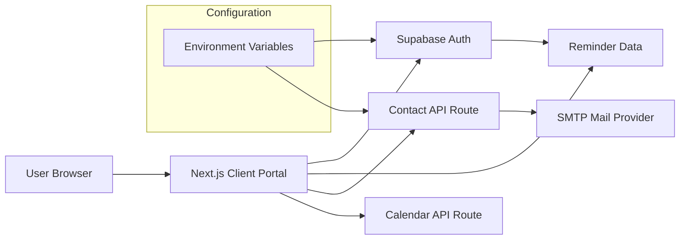

# Client Service Portal Demo

A Next.js customer self-service portal featuring Supabase authentication, service request forms, inspection reminders, server-side email submission, and calendar export.

The project began as a private application built around a real service organization. For this repository, organization-specific branding, live operational links, credentials, account identifiers, and deployment details have been replaced with generic equivalents while preserving the application structure and core workflows.

## What this project demonstrates

- Next.js App Router application structure
- React client-side forms and state handling
- Supabase authentication and account-recovery flows
- authenticated reminder data stored through Supabase
- server-side email submission with Nodemailer
- calendar `.ics` generation through an API route
- reusable form components
- loading, error, validation, and success states
- environment-variable based configuration
- troubleshooting across frontend and backend integration points
- security-conscious separation of application code and private deployment values

## Architecture



For a deeper explanation, see [docs/architecture.md](docs/architecture.md).

## Main features

### Authentication

Users can register, sign in, request a password reset, update a recovered password, and sign out through Supabase Auth.

### Service request, inquiry, and feedback forms

The portal contains reusable form flows for service requests, general inquiries, and customer feedback. Submissions are sent to a server-side API route so SMTP credentials stay outside browser code.

### Inspection reminders

Authenticated users can save inspection reminders through Supabase, review upcoming and past reminders, delete saved reminders, and generate a portable `.ics` calendar file.

### Calendar generation

The `/api/calendar` route accepts reminder details, escapes calendar text, and returns an `.ics` download suitable for common calendar applications.

## Technology

| Area | Implementation |
| --- | --- |
| Framework | Next.js 16 |
| UI | React 19 |
| Styling | Tailwind CSS |
| Authentication | Supabase Auth |
| Data access | Supabase client |
| Email | Nodemailer over SMTP |
| Calendar export | Server-generated iCalendar |
| Configuration | Environment variables |

## Security approach

Application secrets and organization-specific values are kept outside the source tree. SMTP credentials are read only by the server-side contact route, while browser-side Supabase access uses the client configuration expected by Supabase.

An earlier authentication prototype stored plaintext credentials in browser `localStorage`. The active authentication flow had already moved to Supabase Auth, and the obsolete helper was removed from this version of the project.

A frontend/backend mismatch in the General Inquiry flow was also corrected so all documented form types use the same API contract. See [docs/project-scope.md](docs/project-scope.md) for the project history and current limitations.

For a deeper explanation of credential handling, authorization boundaries, and remaining production gaps, see [docs/security-considerations.md](docs/security-considerations.md).

## Local setup

1. Install dependencies:

```bash
npm install
```

2. Copy the example environment file:

```bash
cp .env.example .env.local
```

3. Replace the placeholders with credentials for your own test services.

4. Run the development server:

```bash
npm run dev
```

5. Open the local development URL printed by Next.js.

The local environment file is excluded through `.gitignore` so credentials remain outside version control.

## Supabase data expectation

The reminder UI expects an `inspection_reminders` table containing at least:

- `id`
- `user_id`
- `site_name`
- `inspection_type`
- `inspection_date`
- `notes`

The original project did not preserve authoritative database migration or Row Level Security policy files. The repository therefore documents the interface expected by the application without presenting a production-complete database definition. See [docs/data-model.md](docs/data-model.md).

## Repository guide

| Document | Purpose |
| --- | --- |
| [Architecture](docs/architecture.md) | Component and data-flow architecture |
| [Authentication](docs/authentication.md) | Supabase authentication flow |
| [Forms and email](docs/forms-and-email.md) | Form submission and SMTP architecture |
| [Calendar reminders](docs/calendar-reminders.md) | Reminder storage and `.ics` export |
| [Data model](docs/data-model.md) | Expected reminder fields and database limitations |
| [Troubleshooting](docs/troubleshooting.md) | Integration issues and fixes found during development |
| [Lessons learned](docs/lessons-learned.md) | Technical lessons and future improvements |
| [Project scope](docs/project-scope.md) | Original functionality, later corrections, and project limits |
| [Security considerations](docs/security-considerations.md) | Credential handling, authorization boundaries, and production gaps |

## Key skills demonstrated

Next.js · React · API routes · Supabase authentication · environment configuration · form handling · server-side email · calendar generation · troubleshooting · data integration · secure configuration · technical documentation

## Scope

This project demonstrates a customer portal application and the decisions behind it. Enterprise authorization, complete threat modeling, production monitoring, PCI-compliant payment processing, high-availability deployment, and a complete customer lifecycle platform are outside the scope of the preserved implementation.
