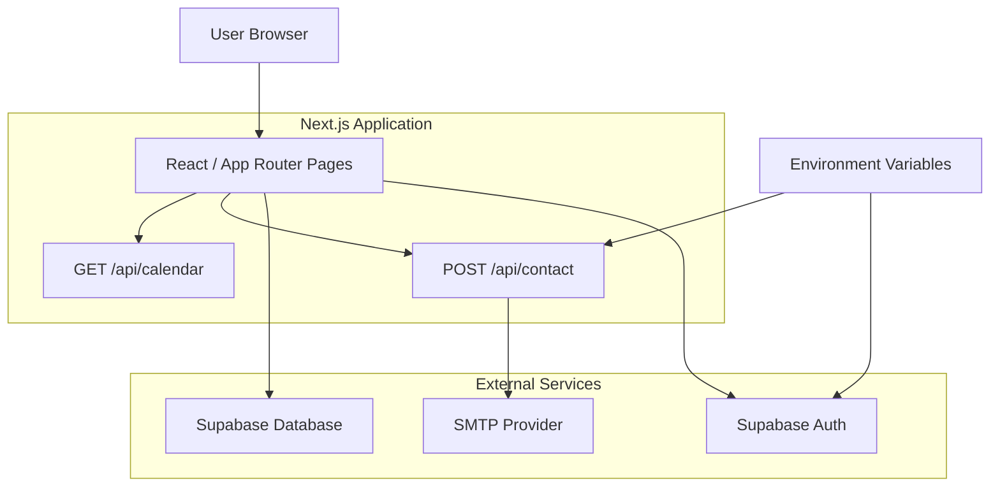

# Architecture

## Logical overview

## Browser layer

The Next.js client pages handle:

- navigation
- form state
- login/registration UI
- password recovery UI
- reminder UI
- success/error/loading feedback

The browser never receives the SMTP password.

## Authentication

The browser creates a Supabase client from two public runtime configuration
values:

- Supabase project URL
- Supabase anonymous client key

Supabase manages login state and password-reset sessions.

## Reminder data

Authenticated pages query the `inspection_reminders` table using the signed-in
user ID.

The recovered application issued user-scoped queries from the browser. Secure
deployment therefore depends on appropriate Supabase Row Level Security
policies. The private repository did not contain authoritative migration/RLS
files, so the public repository does not invent them.

## Contact API

Form pages POST JSON to `/api/contact`.

The server route:

1. validates the form type;
2. validates required inputs;
3. builds plain-text and escaped-HTML mail;
4. reads SMTP configuration from server environment variables;
5. sends mail using Nodemailer;
6. returns a JSON success/error response.

## Calendar API

`/api/calendar` receives reminder details and returns an iCalendar file.

The route escapes calendar-special characters and generates:

- UID
- timestamps
- title
- description
- download filename

No external calendar API is required.
