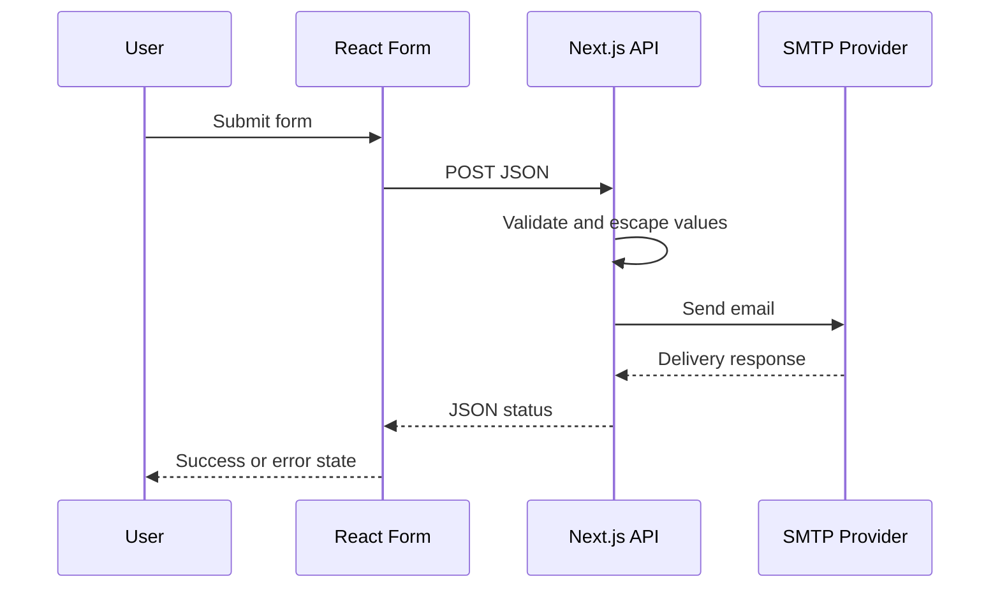

# Forms and Email Flow

## Supported public form types

- Service request
- General inquiry
- Feedback

All forms POST JSON to a shared server route.

## Why server-side mail matters

The SMTP username/password remain server-side environment values rather than
being embedded into browser JavaScript.

## Portfolio cleanup

The recovered source had a mismatch where the General Inquiry frontend used a
`general` form type that the backend did not handle. The public release fixes
that branch and documents the change in `PROJECT_ACCURACY_REVIEW.md`.

The public version also escapes HTML derived from user input before composing
HTML email.
