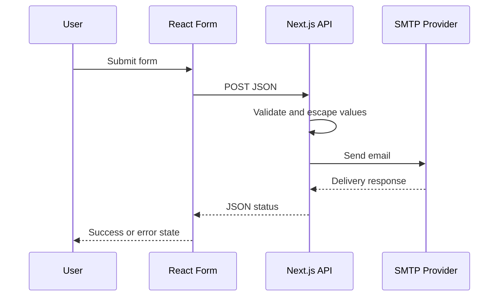

# Forms and Email Flow

## Supported form types

- Service request
- General inquiry
- Feedback

All forms POST JSON to a shared server route.

## Why server-side mail matters

The SMTP username and password remain server-side environment values rather than being embedded into browser JavaScript.

## Integration correction

During review of the application, I found that the General Inquiry frontend submitted `formType: "general"` while the shared contact API handled only service requests and feedback.

The API now includes the matching `general` branch so the frontend and backend use the same contract.

User-controlled values are also escaped before being inserted into HTML email content. This keeps the email route aligned with the form behavior shown in the interface and reduces unsafe rendering of submitted text.
